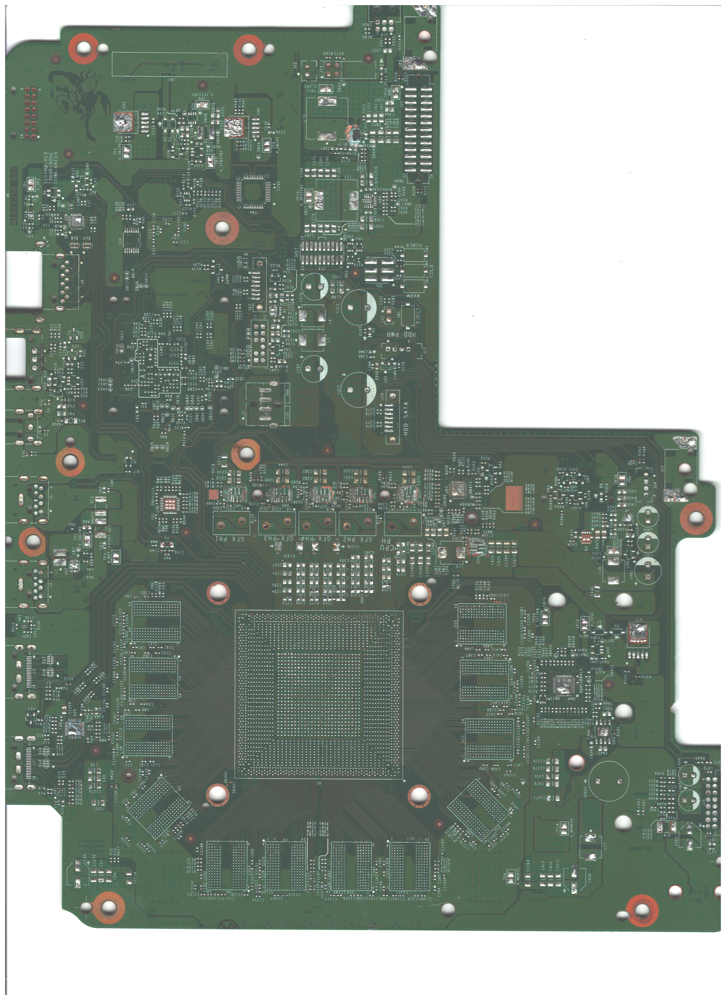

# Xbox One X

In exprience of repairing X1X motherboards, I've accumulated many M1037358-002 motherboards (indicated by the numbers near the top right corner near the scorpion icon) so this will be the main mb version that will be reverse engineered. I've yet to find any real differences between the versions besides the main power rail having different mosfets.

### Initial Photos

* Removed all power rail coils
* Removed larger capacitors so the board sits flat on preheater
* Remove power supply connector as it's very tall and won't sit correctly on preheater



### Preheater

Due to the thickness of this PCB (right at 1.5mm) the removal of componets won't be possible without one. The eBay link is of the one I currently use with great success.

```
https://ebay.us/L72kBJ
```

## Processing

The current process of setting up scanning for eventually getting a gerberfile

* Remove all componets from MB
* Using MagnaStrip 500 to remove silkscreening
* Send MB to a photographer that specializies in high DPI scanning for photos 
* Start delayering process. Research is showing the basic sanding method of being the most effective and cheapest. Given there's likely 12 layers in this board, it'll be a hell of a process in getting each layer done, then sending to a scanning company for images.
```
Quite a few photo companies specializing in scanning are able to do PCB scanning at about $1.50 an image
```
* Once delayering of all levels are scanned in, I've found a very specialized freelancer that will use Photoshop to our advantage to help starting with a basic board viewer 
```
more to follow
```