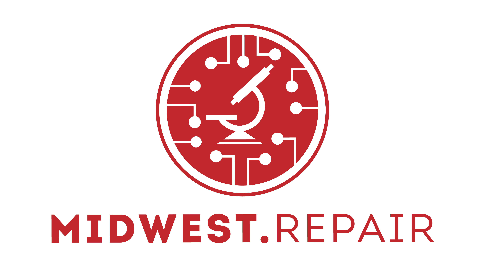

<!-- PROJECT LOGO -->
 

  

  <h3 align="center">Reverse Engineering PCBs</h3>

  

    A community advocating for right to repair!
     
    <a href="https://github.com/midwest-repair/Reverse-Engineering">View Main Repo</a>
    ·
    <a href="https://github.com/midwest-repair/Reverse-Engineering/issues">Incorrect Info?</a>
    ·
    <a href="https://github.com/midwest-repair/Reverse-Engineering/issues">Have more information to share?</a>
  

